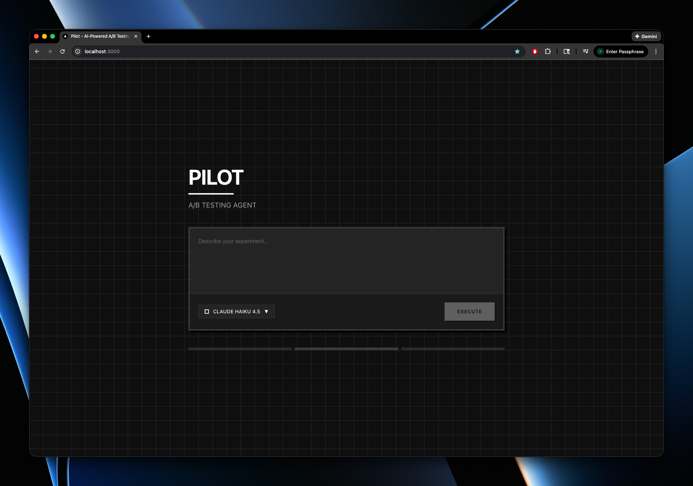

# Pilot - AI-Powered A/B Testing Agent

Pilot is an AI assistant that automates the entire A/B testing workflow with PostHog. Simply describe your experiment idea in natural language, and Pilot will create the experiment in PostHog and optionally integrate the feature flag directly into your codebase.

## Demo



[Watch Pilot in action!](https://youtu.be/Q4hs1AK8VfQ)

## What Pilot Does

Pilot uses AI tool calling to automate three key operations:

1. **Project Detection**: Automatically finds your PostHog project
2. **Experiment Creation**: Creates A/B tests with feature flags and metrics (currently uses `page leave` reduction)
3. **Code Integration**: Clones your GitHub repository, detects your framework, adds the feature flag code, and commits the changes

### Example

You say: *"Test a new checkout button design that reduces cart abandonment"*

Pilot will:
- Retrieve your PostHog project
- Create an experiment with a unique feature flag key
- Add the feature flag code to your repository (if you provide a GitHub URL)
- Handle framework-specific implementation (React, Next.js, Python, etc.)

## API Keys Required

You'll need three API keys to use Pilot:

### 1. Anthropic API Key
Get from [Anthropic Console](https://console.anthropic.com/)

This powers Pilot's AI capabilities using Claude Sonnet 4.

### 2. PostHog Personal API Key
Get from [PostHog Settings](https://us.posthog.com/settings/user-api-keys)

**Important:** Your PostHog API key must have these permissions, otherwise we won't be able to create experiments:
- `project:read`
- `feature_flag:write`
- `experiment:write`

### 3. MorphLLM API Key
Get from [MorphLLM](https://morphllm.com)

This is used for intelligent code editing and merging feature flags into your codebase.

## Installation & Setup

1. Clone and install dependencies:
```bash
git clone <your-repo-url>
cd pilot
pnpm install
```

2. Set up environment variables:
```bash
cp .env.example .env.local
```

Edit `.env.local` and add your API keys:
```
ANTHROPIC_API_KEY=your_anthropic_key_here
POSTHOG_PERSONAL_API_KEY=your_posthog_key_here
MORPH_LLM_API_KEY=your_morphllm_key_here
GITHUB_TOKEN=your_github_token
GROQ_API_KEY=your_groq_key_here
```

## Running Pilot

Start the development server:
```bash
pnpm dev
```

Open [http://localhost:3000](http://localhost:3000) in your browser and start chatting with Pilot!

## Usage

Simply describe your experiment hypothesis in the chat interface. Examples:

- *"Create an experiment to test a new hero section on the homepage"*
- *"Test a new pricing page layout. Here's my repo: https://github.com/username/project"*
- *"I want to test a green vs blue CTA button"*

Pilot will handle the rest!

## Supported Frameworks

React, Next.js, Node.js, Python, Django, Flask, and more.

## License

MIT
